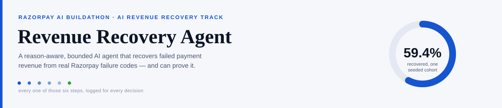
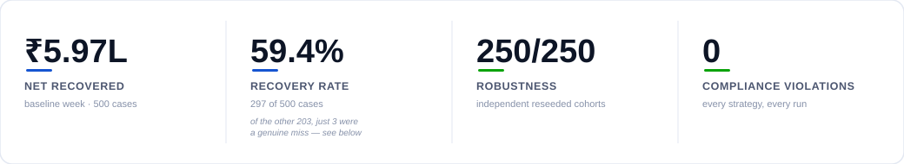
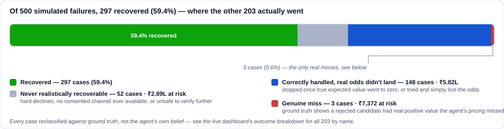
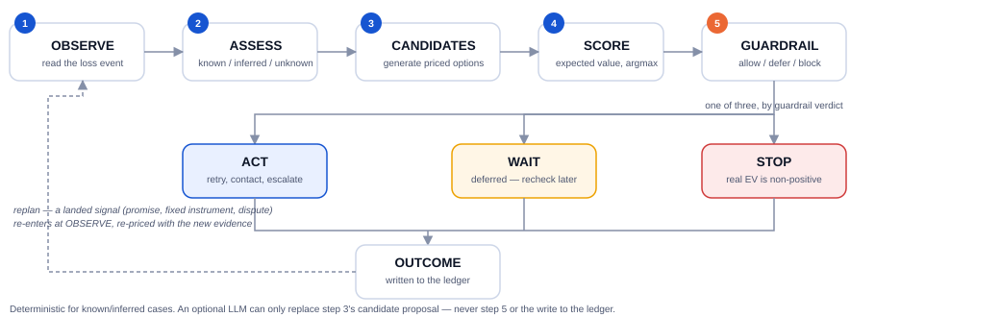
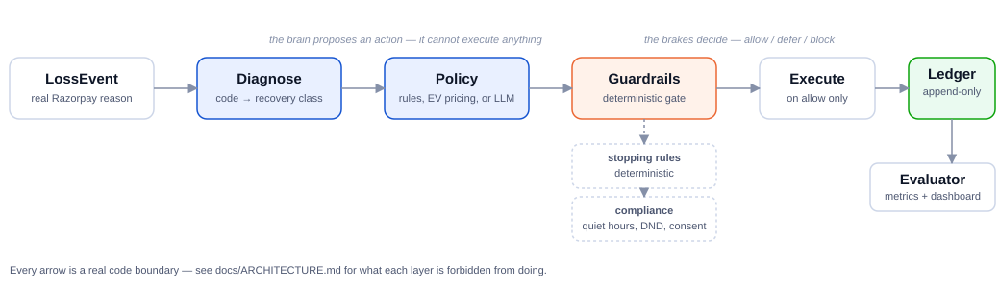

[**Live dashboard**](https://revenue-recovery-agent-beta.vercel.app) · [Architecture](docs/ARCHITECTURE.md) · [Engineering log](docs/ENGINEERING-LOG.md) · [ADRs](docs/adr) · [Sources](docs/SOURCES.md)

A payment fails. The customer wanted to pay, the merchant wanted the money, nothing
fraudulent happened — a bank blipped, a balance was short, a card had expired. Most
recovery systems chase every one of those with the same fixed retry ladder. This
agent reads *why* the payment failed, prices a matched recovery in rupees, and stays
inside hard compliance limits doing it — with every decision written to an append-only
ledger the dashboard reads and never re-simulates.

**Jump to:** [the numbers](#the-result-on-one-seeded-cohort) ·
[watch it decide](#watch-the-agent-work) ·
[is it robust?](#is-594-just-one-lucky-seed) ·
[how it's bounded](#architecture-the-brain-proposes-the-brakes-decide) ·
[what it can't claim](#limitations) ·
[run it yourself](#reproducing-all-of-this)

---

## The result, on one seeded cohort



Two agents built for this, not one — genuinely different reasoning, both
measured against the same three baselines:

- **Reason-aware agent** (`agent-rules`) classifies each failure into one of
  six recovery classes, then follows a fixed, hand-written playbook per
  class — fast on abandonment, patient on funds, zero retries where nothing
  can work. A real improvement over a fixed schedule, but still a lookup
  table underneath.
- **Adaptive agent** (`agent-adaptive`) — **the agent this project ships** —
  skips the lookup table entirely: it prices every candidate action (retry,
  email, SMS, WhatsApp, voice, escalate, stop) in rupees against its own
  belief curves for amount, elapsed time, attempt count and evidence
  quality, and takes whichever clears the highest expected value.

| Strategy | Recovered | Spent | Net after annoyance | Rate | Retries/recovery | Violations |
|---|---:|---:|---:|---:|---:|---:|
| Do nothing | ₹0 | ₹0 | ₹0 | 0.0% | — | 0 |
| Naive retry | ₹2,16,490 | ₹7,713 | ₹2,08,777 | 26.6% | 10.26 | 0 |
| Fixed dunning | ₹2,94,904 | ₹7,151 | ₹2,82,454 | 41.2% | 5.72 | 0 |
| Reason-aware agent | ₹4,14,163 | ₹2,266 | ₹4,01,317 | 49.2% | 2.59 | 0 |
| **Adaptive agent** | **₹6,08,559** | **₹2,228** | **₹5,96,511** | **59.4%** | **2.37** | 0 |

Same 500-case cohort, same guardrails, same cost model, only the policy
changes. **+₹3.14L (+111%) over the best baseline, using 59% fewer retries
per recovery, zero compliance violations, ₹273 recovered per ₹1 spent**
(fixed dunning: ₹41) — see [a real case](#why-this-beats-fixed-dunning)
below where the two agents' different reasoning decides the outcome.

### Why 59.4%, and not more



A recovery rate is not a grade on the agent's decisions — most of the other
40.6% was never realistically gettable, or was correctly stopped once the
*true* expected value (checked against ground truth, not the agent's own
belief) went to zero. Reclassifying every one of the 203 non-recovered
cases this way is what the number above is: 52 had no real path to begin
with (a hard decline, no consented channel, or unsafe to keep pushing);
148 were engaged correctly and simply lost the odds, or were correctly
told to stop; and only **3 of 500 (0.6%)** are a genuine miss — a case
where ground truth shows a rejected candidate actually had positive value.
The [live dashboard](https://revenue-recovery-agent-beta.vercel.app) names
all 203 individually, not just the four buckets.

## Watch the agent work

<video src="docs/assets/dashboard-walkthrough.mp4" width="100%" autoplay muted loop playsinline></video>
The [live dashboard](https://revenue-recovery-agent-beta.vercel.app) replays the
actual decision log this cohort produced — not a script. Every OBSERVE → ASSESS →
CANDIDATES → SCORE → GUARDRAIL → ACT step shown is a real ledger entry; nothing is
staged for the demo. It also carries the case-by-case audit behind the breakdown
above (all 203 non-recovered cases, named individually, not just the four
buckets), the 250-cohort robustness sweep, and one naturally-occurring case
where a simulated Hinglish voice call changes what the agent does next.

## Why this beats fixed dunning

A real case from the cohort, same random draw, same event, two policies:

> **`loss_00063` · ₹14,135 · `transient_funds`**
>
> **Fixed dunning** → retry the payment → ✕ recovered nothing, schedule complete
> **Adaptive agent** → escalate to a human → ✓ recovered ₹14,135
>
> Δ +₹14,135 recovered · +₹44 spent · +20pt annoyance
>
> *The agent's own reasoning, verbatim:* "TRANSIENT_FUNDS: no modelled path for a
> person to unlock this class directly; priced as a small last-resort hedge
> (P=0.05), not a recovery channel."

Fixed dunning is fast *or* patient, never both — its schedule doesn't know this
card has no unlock path a retry can reach. The adaptive agent doesn't get told
that either; it works it out because pricing every candidate, including
options a rules table would never reach for, is the whole mechanism. That's
also why it clears **86.1%** on bank outages and **78.0%** on insufficient
funds against fixed dunning's 81.0% / 38.1% — see the [live dashboard](https://revenue-recovery-agent-beta.vercel.app)
for the full class-by-class table.

## Is 59.4% just one lucky seed?

Two separate checks, run against both agents, so neither number has to be
taken on faith.

- **`npm run eval:robust`** — 5 scenarios × 50 independently reseeded cohorts.
  **One of our two strategies posts the highest net value in 250 of 250** —
  adaptive alone in 211 (84.4%), reason-aware alone in 39 (15.6%). No baseline
  ever wins a cohort outright. Not manufactured: the reason-aware agent *does*
  take individual cohorts from the adaptive agent (39 of them), and the split
  is reported exactly as measured, both directions.
- **`npm run eval:sensitivity`** — the headline metric prices annoyance at
  ₹20/point, the most attackable number here, so it's swept ₹0→₹100 instead
  of defended. The adaptive agent posts the highest net value at every price
  in 4 of 5 scenarios; the one exception (baseline week flips to reason-aware
  at exactly ₹5/point, a ~3% margin) is reported because the sweep found it.

A separate, deliberately un-blended check covers cases outside all five
scenarios: `npm run eval:novelty` runs 12 hand-authored adversarial cases —
unknown reason codes, malformed context, contradictory bookkeeping — and
checks *safe* behaviour, not revenue (a genuinely novel case has no
ground-truth recovery curve to score against). Currently **12/12 safe**, zero
automatic retries on anything unrecognised.

## The decision loop



A landed signal — a promise to pay, an instrument getting fixed, a dispute —
re-enters the loop with new evidence rather than being treated as a dead end.
`WAIT` and `STOP` are different primitives on purpose: a receivable with an
open promise is *waiting*, not finished, and conflating the two was a real bug
([engineering log, entry 12](docs/ENGINEERING-LOG.md)).

## Architecture: the brain proposes, the brakes decide



The policy layer only ever *returns a proposed action* — it cannot execute
anything. Every action passes through a deterministic gate; the engine
executes only on an `allow` verdict. This is structural, not a convention:
a test suite runs an adversarial policy that deliberately tries to retry
infinitely and voice-call at 3am. It cannot. That matters most when an LLM
writes the policy — a prompt-injected or simply wrong model still cannot
breach a limit. Full write-up: [docs/ARCHITECTURE.md](docs/ARCHITECTURE.md).

**Compliance defers, it does not drop.** A message that would land at 21:30
isn't discarded, it's queued for 09:00 the next morning.

<details>
<summary>Show the raw ledger entry</summary>

```json
{
  "caseId": "loss_00403",
  "outcome": "deferred",
  "rule": "QUIET_HOURS",
  "explanation": "Contact would land at 00:01 local, inside quiet hours (21:00-09:00). Deferred to the next permitted window rather than dropped.",
  "deferredTo": 1788233400000
}
```

</details>

Timing rules (quiet hours, cooldowns, caps) defer, because waiting fixes
them. Permission rules (DND, missing consent) block, because waiting never
will. Rules enforced on this cohort:

| Rule | Times fired | Kind |
|---|---:|---|
| `RETRY_COOLDOWN` | 366 | defer |
| `MAX_RETRIES` | 50 | block |
| `QUIET_HOURS` | 48 | defer |
| `CONTACT_COOLDOWN` | 40 | defer |
| `NO_CONSENT` | 17 | block |
| `DND_REGISTERED` | 16 | block |
| `DAILY_CONTACT_CAP` | 5 | block |
| `CASE_AGE_LIMIT` | 1 | block |

**Annoyance is priced as a currency**, not just measured after the fact — ₹20
per point, email 1 / SMS 5 / WhatsApp 5 / voice 10 — because rupee cost alone
cannot constrain a recovery agent (ROI runs 109×–530×, so the money-optimal
policy is "contact everyone on the loudest channel," which wins the
benchmark and loses the merchant). Intrusiveness then scales with the money
at stake by the same arithmetic as everything else: a ₹400 abandoned cart
earns an email, a ₹50,000 receivable earns a WhatsApp message. See
[ADR 0004](docs/adr/0004-price-annoyance-as-a-currency.md).

## Where we chose not to use an LLM

| Component | Implementation | Why |
|---|---|---|
| Compliance rules | Deterministic | Legal constraints — 99.7% compliant breaks the law twice a week |
| Stopping rules | Deterministic | Asking the thing being bounded to enforce its own bound isn't a control |
| Failure classification | Lookup table | 34 documented strings → 6 classes is a dictionary, not inference |
| Retry timing | Fixed per-class schedules | "Why did you retry at 20 hours?" deserves a rule, not a sample |
| Novel/ambiguous cases | **LLM** | Genuinely open-ended input, where the alternative is giving up |

We measured the alternative rather than just arguing it. Same cohort, LLM
actually proposing the action instead of the rules engine:

| | Rules agent | LLM agent |
|---|---:|---:|
| Net after annoyance | **₹3,96,572** | ₹3,39,628 |
| Recovery rate | **49.2%** | 47.4% |
| Retries per recovery | **2.56** | 2.91 |
| Annoyance points | **806** | 1,225 |
| Compliance violations | 0 | 0 |

The LLM is worse on every axis and worst on restraint — 52% more annoyance
for less recovered revenue. The zero in the last column is the guardrail
layer doing its job regardless of which policy proposes the action; when the
LLM output fails schema validation (invented actions, out-of-range delays),
it falls back to the deterministic agent, so **the system runs identically
with the network unplugged**. Full reasoning: [ADR 0003](docs/adr/0003-where-we-chose-not-to-use-an-llm.md).

## Honest Razorpay integration, and where voice stops being real

The benchmark above runs on a simulator, because measuring policy quality
needs cohorts nobody can pay for by hand. Separately, the identical agent and
guardrails also drive **real Razorpay test-mode API calls** — real orders,
real payment links, one genuine decline captured by actually paying a test
card and reading Razorpay's own error response back — `payment_failed` mapped
to `HARD_DECLINE`, agent said stop.

<details>
<summary>Show what Razorpay actually returned</summary>

```
error_code    BAD_REQUEST_ERROR       error_reason  payment_failed
error_source  gateway                 → maps to     HARD_DECLINE
error_step    payment_authorization   → agent says  stop — retrying cannot
                                                      succeed, and repeated
                                                      attempts risk the
                                                      merchant's auth rates
```

</details>

Five hand-driven live cases cannot support a recovery rate, and claiming
otherwise would be the fastest way to lose a technical panel — the statistics
above come entirely from the seeded simulator; the live run only shows the
same policy driving real rails, byte for byte, no `if (live)` anywhere above
the execution layer. Test keys only — the runner asserts an `rzp_test_`
prefix and refuses anything else.

**Voice is simulated, and the dashboard says so on every card.** Razorpay has
no outbound voice API, so the "voice call" shown is a structured-signal
simulation: cost, annoyance price, and landing odds are real, priced
parameters the agent competes honestly against every other channel — but no
telephone ever rings. The Hinglish transcript on the dashboard is generated
for readability from the same structured signal (`promise_to_pay`, `refused`,
…) the engine actually prices; the engine itself never sees a sentence in
any language, and no transcript can change what the agent decides.

## What broke (the short version)

Six real defects, each found by a test or an audit before it shipped rather
than after — full account in [docs/ENGINEERING-LOG.md](docs/ENGINEERING-LOG.md).

<details>
<summary>Show all six</summary>

1. A guardrail accidentally doubled the naive-retry baseline's score — kept
   it and raised our own bar instead of exempting the baseline.
2. The agent first won by being annoying (1,101 spam points vs. dunning's
   212) — fixed by pricing annoyance as a currency, not a rupee penalty.
3. Every message was overvalued 3–5× — contacts were priced on retry odds,
   not on whether the nudge itself would land. Two failing tests caught it.
4. Compliance was over-blocking — TRAI DND covers telecom, not email; being
   over-strict on compliance is just a different way of being wrong.
5. `STOP` was quietly doing the job of `WAIT`, closing receivables the
   instant a promise-to-pay was made. Fixed by adding a real `wait` action,
   then building `agent-adaptive` from scratch around pricing instead of a
   schedule.
6. A boundary bug priced a post-nudge retry's payoff at literal elapsed=0,
   discarding real recoveries — found by this project's own audit, not an
   external review.

</details>

## Limitations

- **All data is synthetic.** Failure *reason codes* are real (Razorpay's
  published card/UPI docs); the failure *mix* is grounded in NPCI's UPI
  operating targets but not identical to them; the recovery-probability
  curves and cost model are ours, named and commented. These numbers
  demonstrate policy quality on identical seeded cohorts — they are not a
  production revenue forecast. See [docs/SOURCES.md](docs/SOURCES.md).
- **The ₹20/point annoyance price is a judgement call**, swept rather than
  defended, and it does change the winner in one of five scenarios at one
  price point (see above) — reported, not hidden.
- **Live Razorpay coverage is five hand-driven cases**, enough to prove the
  policy runs on real rails, not enough to support a recovery-rate claim.
- **Voice is a priced simulation, not a live channel** — see above.
- **No online learning yet.** Recovery-probability curves are fixed constants
  set from the documented failure taxonomy, not updated from outcomes; see
  [ADR 0008](docs/adr/0008-why-not-online-learning-yet.md) for why that's a
  deliberate sequencing choice, not an oversight.
- **The reason-aware agent still wins some individual cohorts and one
  scenario at one price point** — the adaptive agent is the stronger policy
  on average, not a strict dominator, and the README says so rather than
  picking the cohort that flatters it.

## Reproducing all of this

```bash
npm install
npm run eval                    # baseline-week, or: npm run eval -- bank-outage
npm run eval:robust             # 250-cohort robustness sweep
npm run eval:sensitivity        # ₹0–100 annoyance-price sweep
npm run eval:novelty            # 12 adversarial safety cases
npm test                        # 262 tests, incl. an adversarial policy that
                                 # cannot breach any guardrail
npm run eval:all && npm run dashboard   # regenerate the bundle, view it locally
```

Scenarios: `baseline-week` · `bank-outage` · `month-end-squeeze` ·
`risk-spike` · `stale-instruments`.

Optional LLM policy — free tiers only, no paid service anywhere in this
project:

```bash
LLM_API_KEY=your_groq_key npm run eval
```

Works with Groq, OpenRouter, Cerebras, or anything OpenAI-compatible; set
`LLM_PROVIDER` / `LLM_BASE_URL` to switch. The live-Razorpay path
(`npm run live`, `npm run decline:create` / `decline:capture`) needs
`.env` test keys — gitignored, and the runner refuses anything without an
`rzp_test_` prefix.

## Repo map

```
src/
  domain/      failure taxonomy (real Razorpay codes), core types
  sim/         seeded generator, recovery model, scenarios
  policies/    baselines, reason-aware agent, adaptive agent, LLM agent
  guardrails/  compliance, stopping rules, the gate
  ledger/      append-only audit trail
  llm/         provider-agnostic client, schema validation
  eval/        engine, metrics, report, CLI
dashboard/     the viewer above — reads the eval bundle, simulates nothing
docs/
  adr/         nine architecture decision records
  SOURCES.md   what is real, what is assumed
  ENGINEERING-LOG.md
```

## Why this track

Revenue recovery gives an indisputable answer: the money either arrived or
it didn't. Razorpay asked for measured money recovered across a batch, with
compliant escalation, stopping rules, and an audit trail — this is that, and
each of the four is a file you can open.

---

MIT licensed. See [LICENSE](LICENSE).
